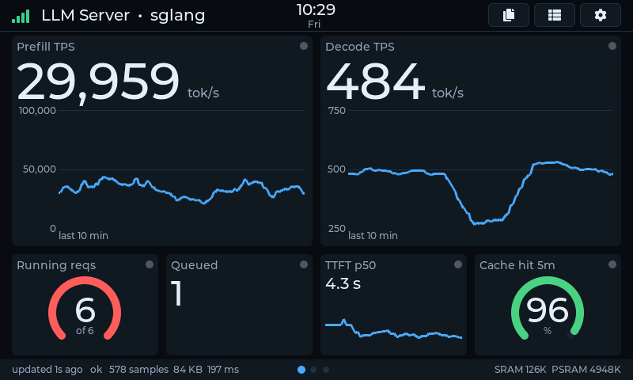
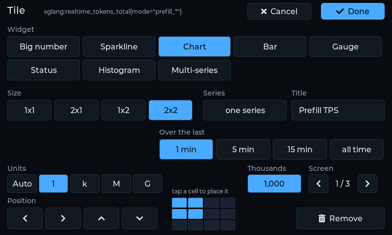
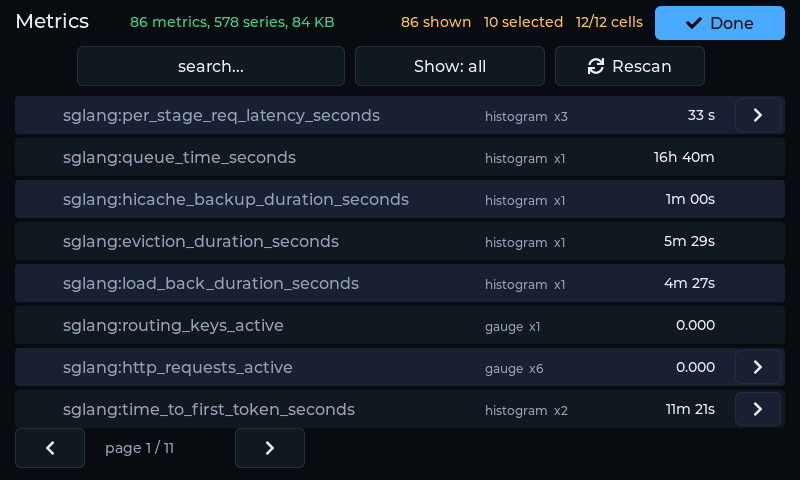
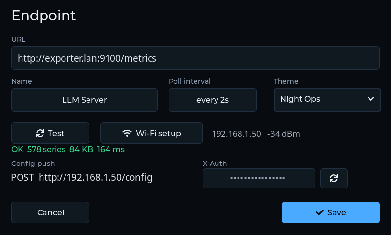
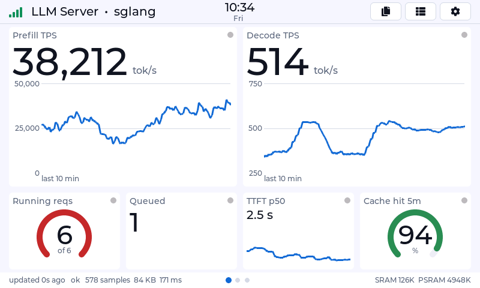
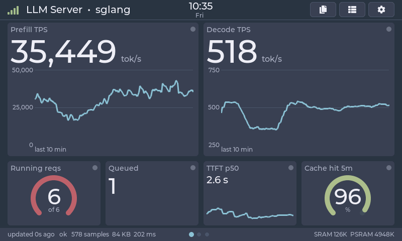

# prometheus-esp32

A generic **Prometheus metrics panel** for the **Waveshare ESP32-S3-Touch-LCD-7**
(the 800x480 model, capacitive touch). Point it at any metrics endpoint, pick
the metrics you care about on the touchscreen, hang it on a wall.

- Reads **raw `/metrics`** text exposition from any exporter, and a
  **Prometheus server's HTTP API** (`/api/v1/query`, `/api/v1/query_range`).
- Renders counters (as rates), gauges, histograms (bucket distribution and
  derived quantiles) and summaries.
- **Configured entirely on the glass** -- WiFi, endpoint URLs, metric
  selection. No companion web page, no serial console.
- Multiple screens with swipe and auto-rotate; settings and selections survive
  a power cut.

Board bring-up (`main/waveshare_rgb_lcd_port.*`, `main/lvgl_port.*`) comes from
[waveshare-ips-esp32](../waveshare-ips-esp32), which extracted it from
[theqkash/esp32flight](https://github.com/theqkash/esp32flight) (MIT).

## Screenshots

Taken from the device itself over `GET /screenshot`, so they are the panel's
own pixels rather than a photograph of a backlit screen. The endpoint here is
an sglang inference server on the same LAN.

| | |
|---|---|
|  |  |
| The dashboard: a 4x3 grid of tiles, one screen of several | A tile's settings: widget, span, position, title, units |
|  |  |
| The metric browser, listing what the endpoint exposes | The endpoint editor with its Test button |
|  |  |
| The same screen in Daylight | and in Nord |

```sh
curl -H "X-Auth: $TOK" http://$D/screenshot > panel.bmp     # or
tools/screenshot.py --host $D --token $TOK panel.png        # needs Pillow
```

## Hardware

One board, no wiring. Everything the firmware needs is on it.

| | |
|---|---|
| Board | Waveshare **ESP32-S3-Touch-LCD-7**, the 800x480 model. The other sizes in that family carry different panels and timings and have not been tried. |
| Module | ESP32-S3-WROOM-1 **N16R8**: dual-core Xtensa LX7 at 240 MHz, **16 MB** quad-SPI flash, **8 MB** octal PSRAM. Both buses run at 80 MHz. |
| Display | 7" IPS, 800x480, driven directly by the S3's RGB peripheral over a **16-bit parallel bus** (RGB565) at a 16 MHz pixel clock, ~31 Hz refresh. There is no display controller chip; the two framebuffers live in PSRAM and the chip scans them out itself. |
| Touch | **GT911** capacitive controller on I2C (address 0x5D), up to five points; the firmware uses one. |
| Expander | **CH422G** I2C IO expander. The LCD reset, touch reset and backlight lines all hang off it, not off the S3. |
| Console | The chip's **native USB** (serial/JTAG) on the USB-C port, `303a:1001`. No UART bridge. |
| Power | 5 V over the same USB-C port. |
| Unused | The SD slot, RS485 and CAN transceivers, the sensor header and the external I2C terminal are not touched. |

The pin map, from `main/waveshare_rgb_lcd_port.h`:

| Signal | GPIO | | Signal | GPIO |
|---|---|---|---|---|
| I2C SCL / SDA | 9 / 8 | | RGB VSYNC / HSYNC | 3 / 46 |
| Touch INT | 4 | | RGB DE / PCLK | 5 / 7 |
| RGB B0..B4 (DATA0-4) | 14 38 18 17 10 | | RGB G0..G5 (DATA5-10) | 39 0 45 48 47 21 |
| RGB R0..R4 (DATA11-15) | 1 2 42 41 40 | | | |

On the expander: EXIO1 is touch reset, **EXIO2 is the backlight**, EXIO3 is
LCD reset, EXIO4 the SD chip select, and EXIO5 routes the USB-C port to
either native USB (low) or the CAN transceiver.

Two consequences of that wiring shape the firmware:

- The backlight is a plain **on/off** line on the expander. There is no PWM
  pin and no PWM peripheral behind it, so there is no brightness slider.
  Instead there are **six themes**, and a blackout schedule that turns the
  panel off entirely.
- **GPIO0 is a data line** (green bit 1). The BOOT button shares it, so the
  button cannot be read once the display is running. Recovery from a bad
  config or a wedged flash is `idf.py erase-flash` over USB; there is no
  on-device escape hatch.

## Getting started

You need the board, a USB-C cable, **ESP-IDF 5.5.x** on the host, and
something on your network that serves Prometheus metrics. If you do not have
an exporter handy yet, `tools/fake_exporter.py` is one.

**1. Build and flash.** Plug the board in; it shows up as `/dev/ttyACM0`.

```sh
. $IDF_PATH/export.sh
idf.py set-target esp32s3          # first time only
idf.py build
idf.py -p /dev/ttyACM0 flash
```

`flash` writes the bootloader, the partition table (16 MB: dual OTA slots and
two LittleFS partitions) and the app. LVGL, the touch driver and LittleFS are
fetched by the component manager during the first build.

**2. Join Wi-Fi.** First boot lands in the setup wizard: pick a network from
the scan, type the password on the on-screen keyboard, Join. The panel
remembers it. The wizard is reachable again later from the settings sheet.

**3. Point it at an exporter.** Tap the **gear**. Enter the metrics URL, for
example `http://192.168.1.20:9100/metrics` for node_exporter, and press
**Test**. Test tells a wrong host from a wrong path from "that is a web page,
not metrics", so fix what it names and save.

**4. Put something on the screen.** Tap a **`+`** on any empty cell. The metric
browser lists everything the endpoint exposes; tick one. The widget, units and
aggregation are inferred from the metric's name and type -- a counter becomes
a rate, `_bytes` becomes KiB/MiB, `_seconds` becomes a duration -- so most
tiles need nothing more. Tap the tile afterwards to change any of that, or to
move and resize it.

**5. Optional: script it.** The panel serves its configuration over HTTP.
The token is on the device under the gear, as **Config push token**.

```sh
D=192.168.1.50                              # the address is in the settings sheet
curl http://$D/status                       # no token needed
curl -H "X-Auth: $TOK" http://$D/config     # what is on the glass, as JSON
```

The rest of this document is about what that JSON can say.

**Trying it without an exporter.** On the machine you built from:

```sh
python3 tools/fake_exporter.py --port 9100
```

and give the panel `http://<that machine>:9100/metrics`. It serves counters
that climb, a gauge that wanders and a histogram that fills, which is enough
to see every widget do something.

## Status

Everything below runs on hardware. Nothing about which endpoint is polled or
which metrics appear is compiled in.

| | |
|---|---|
| Panel, partitions, LittleFS storage | done |
| Streaming exposition parser (+ host tests) | done |
| WiFi setup on the glass: scan, password, live reconnect | done |
| Endpoint editor: URL keyboard, one-tap chips, Test | done |
| Metric browser: discover, search, tick | done |
| Two-level drill-down to a specific label set | done |
| Configure by tapping an empty cell | done |
| Per-tile settings: widget, span, title, series mode | done |
| Renderers: stat, sparkline, chart, bar, gauge, status, histogram, multi | done |
| Derived tiles: share / ratio / difference / sum of two series | done |
| Config persists across power loss (atomic writes) | done |
| Multiple screens, swipe between them | done |
| Layouts saved by name, switched from the header | done |
| Screenshot of the glass over HTTP | done |

Not built yet: editable warn/crit thresholds, SUMMARY and RATE renderers, the
PromQL client, OTA, history that survives a reboot.

## Using it

First boot lands in the WiFi wizard. After that:

- **gear** -- the endpoint: URL, name, poll interval, and a Test button that
  distinguishes a wrong host from a wrong path from "that is a web page".
- **a `+` on an empty cell** -- choose what goes there, then how it looks.
- **any tile** -- widget type, span, position, title, one-series vs
  all-series, and combining it with a second series. The arrows nudge it one
  cell; the 4x3 miniature beside them places it anywhere it fits -- tap a
  cell to put the tile's top-left there. Cells outlined green can take it at
  its current size, which is what makes a 2x2 chart movable on a busy grid.
- **list button** -- browse everything the endpoint exposes; `Show: selected`
  filters to what is already on screen, which is the view for removing tiles.

A ticked metric infers its format, aggregation and widget from Prometheus
naming conventions -- counters become rates, `_bytes` becomes IEC, `_seconds`
becomes a duration, ratios become gauges -- so the common case needs no
further input.

## The HTTP API

The device describes itself, so something that has never seen it can work out
what it can do:

```sh
curl http://$D/            # the routes, what they do, which need auth
curl http://$D/schema      # the config format and every legal value
curl http://$D/status      # identity, uptime, free memory
```

`/schema` generates its enum lists from the same tables the parser uses, so a
documented value is a value that will be accepted.

```sh
curl -H "X-Auth: $TOK" http://$D/metrics-seen
```

scrapes the configured endpoint and reports every metric family it exposes --
name, type, how many label sets, and a sample selector to copy. That is the
half `/schema` cannot provide: the format is knowable from the firmware, but
which metrics exist is not.

### Units

`panel.scale` pins the SI/IEC prefix. Auto-scaling is the default and keeps
three significant digits at any magnitude, but it means the unit moves as the
value does -- a series sitting near a thousand alternates between `847 tok/s`
and `1.20 ktok/s`, which are the same reading in different clothes and take a
second look to tell apart. Pinning trades significant digits for a number
whose scale never shifts, so a glance across the room is enough.

The names are the SI ladder (`auto 1 k M G T P m u n p`) and map by position
on a byte panel: `k` is KiB, `M` is MiB. Formats with no ladder -- percent,
duration, bool -- ignore it. On the glass it is the Units row in a tile's
settings, labelled from whichever ladder that tile's format uses.

A pin applies to the axis and the quantiles as well as the value, so nothing
on a tile can disagree with the number above it.

`panel.prefix` and `panel.suffix` wrap free text around the value -- `$1,234`
or `1,234 EUR` -- for labels the SI ladder cannot express. They are distinct
from `unit`, which is part of the magnitude and moves with the prefix
(`ktok/s`); these do not.

The large digit faces carry only digits, punctuation and the currency marks
`$ c/ L- Y= E=`, because a glyph a font lacks draws as *nothing* rather than as
a box. `ui_fmt_digits_safe` is the single definition of that set, and an affix
outside it drops the whole value to a smaller text face rather than vanishing
-- the same fallback durations already use.

A `multi` panel's rows use the same window as its single value would. Both go
through one ring, so the two cannot drift apart again.

`panel.group` turns on thousands separators -- `17,321` rather than `17321`.
It only bites once a number is four digits long, which in practice means
alongside a pin, since an auto prefix keeps it to three. The comma is in the
digits-only font's charset, so a grouped number still renders in the large
faces.

Both options make a reading longer, so the numeric face is chosen from the
text rather than from the tile's span: a 2x1 tile showing `2,842,612,288`
steps down one rung instead of ellipsing the number into nonsense.

### Windows

`term.window_s` is the span a rate or quantile covers, and it means what it
says at any size. The ring holds a fixed number of baselines and spaces them
at `window_s / (slots - 1)`, so a one-hour window reaches back an hour rather
than as far as the last two dozen polls happened to reach. It resolves the
window's start to within one spacing; the current value is never affected,
since only the baseline comes from the ring.

`fmt: "rate_hour"` renders a per-second rate as a per-hour quantity. The value
on the wire is unchanged -- it is a unit, for the questions that are about
volume rather than speed.

### What a save does not reset

Saving anything rewrites every panel, and the accumulated state -- counter
baselines, windowed rings, quantile baselines, chart history -- is expensive
to rebuild: an hour-long window needs another hour. So it is carried across a
reload wherever the thing that produced it is unchanged.

The rule is one question asked in two places: *does this produce the same
numbers?* Selector, reduce, agg, window and quantile decide it. Title, widget,
position, span and colour do not, so moving or retitling a tile costs nothing.
The poller carries per-term baselines by exact comparison; the dashboard
adopts the tile rather than rebuilding it, keeping its chart. A term whose
definition did change starts over, because a stale baseline is worse than an
absent one -- it is wrong rather than merely empty.

Tiles exist for every screen, not just the one on display, so paging is a
visibility change. Swipe to a page and its charts are already drawn.

### The top bar

Wi-Fi strength hard left, then endpoint and layout, then the time and date
centred on the screen. Signal reads first because it is the one thing that
explains everything else being wrong. Bars rather than a single glyph: height says how much signal,
colour says whether it is a problem, and either alone is readable across a
room. Wi-Fi setup and the IP address are in the settings sheet -- both are things
you touch once, while setting the device up, and that is where setting up
happens.

The clock is SNTP, and `device.tz` is a POSIX TZ string (`EST5EDT,M3.2.0,M11.1.0`,
`GMT0BST,M3.5.0/1,M10.5.0`). Note the sign convention is inverted from UTC
offsets: `PST8PDT` means UTC-8. `GET /status` reports the clock, so "is it
synced" is answerable without looking at the glass. Nothing else in the app
reads wall time -- every rate, window and staleness check is taken against the
monotonic clock, so a step correction disturbs nothing.

### Themes and colour

Six palettes ship -- Night Ops, Daylight, Emerald, Nord, Amber, Mono -- picked
from the Theme dropdown in the settings sheet and stored in `device.theme`.
Switching rebuilds the whole widget tree rather than restyling it in place:
every colour is read at build time, so a palette works everywhere by
construction and no renderer has a restyle hook to keep in step.

Switching keeps what is on screen: chart history is carried across the
rebuild, keyed by panel id and data fingerprint, and the tiles repaint from
the snapshot already in hand rather than waiting for the next scrape. The same
carry covers a change of widget kind, which the adopt path cannot handle.

A panel's published value is the **displayed** quantity in every format --
a 0..1 ratio as 0..100, a per-second rate as per-hour where the format says
so. Everything that reads it (charts, gauge and bar ranges, the peak) wants
what the tile says, not what the formatter will later turn it into. Axis ticks
and range endpoints are then written as bare magnitudes in the right base:
no unit, no `/s`, but 1024s for a byte panel.

`vmin`/`vmax` are in the **displayed** domain -- a percent panel reads 0..100
whatever ratio feeds it. `null` means auto: 100 for a percent, and otherwise
**the largest value seen so far**. That is the answer for a gauge whose full
scale nobody can look up: an inference server does not export its own
concurrency limit, so the highest reading yet is the only honest 100%. The
caption says what that is (`of 6`), because a needle against an invisible
maximum tells you nothing.

The peak never decays -- "the most this has ever been" is the question -- and
resets when the device restarts or the panel's terms change. It survives a
rename, a resize, and a config push.

`panel.ramp` colours a gauge or bar by where the value sits in its range:
`heat` runs ok to crit as it rises, `cool` reverses that for things where low
is the problem, `series` steps through the categorical palette, and `none`
takes the threshold colour -- which on a panel with no `warn`/`crit` set is
one colour forever, which is why a gauge looks monochrome by default. The ramp
is mixed from the active theme's own colours, so it follows the palette rather
than fighting it.

### Screens

A tile carries a `screen`, and swiping pages between them. Screens are not a
list you maintain -- a screen exists because something is on it, and the page
after the last one is always there while panels remain in budget, so a new
screen is made by swiping to it and tapping a cell. Every screen's panels are
polled whether or not you are looking at them, so a counter has its baseline
and a chart its history by the time you swipe across.

### Layouts

A layout is the presentation half -- screens and panels -- saved under a name.
Endpoints and device settings are deliberately not part of one, because the
same URL can serve completely different metrics depending on what is running
behind it. An sglang layout and a vllm layout point at the same host and share
nothing else.

On the device, the header's layouts button lists what is saved, marks which
one is on screen, and switches with one tap. Switching away from an
arrangement that was never saved stores it as `autosave` first, so hand-placed
tiles are never lost to a tap.

```sh
curl -X POST -H "X-Auth: $TOK" http://$D/layouts/sglang/save      # store what is on screen
curl -X POST -H "X-Auth: $TOK" --data-binary @vllm.json \
     http://$D/layouts/vllm                                       # apply and store
curl -X POST -H "X-Auth: $TOK" http://$D/layouts/sglang/activate  # switch
curl      -H "X-Auth: $TOK" http://$D/layouts                     # list, and which is active
curl -X DELETE -H "X-Auth: $TOK" http://$D/layouts/vllm
```

### What a push is checked against

A pushed document is parsed into a scratch config, checked whole, and swapped
in only if every check passes -- or rejected with one sentence naming the
panel and saying what to fix. Nothing is half-applied.

Names are checked against the tables the parser itself uses, so an unknown
`kind` is refused rather than defaulted, and enum *numbers* are refused
outright: they shift when an enum gains a member. Unknown fields are refused
too, because in practice an unknown field is a misspelling of a known one, and
silently dropping `colum` puts the tile at column zero with a 200 OK.

Beyond the shape: every selector must parse, quantiles must be 0 to 1, a
widget must fit its minimum span, ids must be unique, endpoints referenced
must exist, `vmin` must be below `vmax`, and panels must not overlap on a
screen or run off the grid. Exceeding a limit is refused rather than
truncated -- a silently dropped thirteenth panel is a tile that never appears
and never explains itself.

## Pushing configuration

The touch UI is good for adjusting a tile. It is a poor place to express "sum
the rate over every series whose mode matches `prefill_*`". So the device
serves the same JSON that lives on its flash:

```sh
TOK=...                      # shown on the device: gear -> Config push
D=192.168.1.50               # the address in the panel's header

curl -H "X-Auth: $TOK" http://$D/config > panel.json
$EDITOR panel.json
curl -X POST -H "X-Auth: $TOK" --data-binary @panel.json http://$D/config
```

`GET /status` needs no token and carries nothing sensitive -- it is what you
check when something is wrong.

A panel is a list of **terms** combined by an **op**. Each term selects a SET
of series (label values may contain `*`) and a **reduce** collapses that set
to one number. That is the `sum by()` of this format:

```json
{ "title": "prefix hit rate", "kind": "gauge", "fmt": "percent",
  "op": "share",
  "col": 2, "row": 2, "w": 1, "h": 1,
  "terms": [
    { "sel": "sglang:realtime_tokens_total{mode=\"prefill_cache\"}",
      "reduce": "sum", "agg": "rate", "window_s": 60 },
    { "sel": "sglang:realtime_tokens_total{mode=\"prefill_compute\"}",
      "reduce": "sum", "agg": "rate", "window_s": 60 }
  ]
}
```

| field | values |
|---|---|
| `kind` | stat, sparkline, chart, bar, gauge, status, histogram, multi |
| `fmt` | auto, raw, si, bytes, percent, percent100, duration, rate, rate_bytes, bool |
| `reduce` | sum, avg, min, max, count, first |
| `agg` | last, rate |
| `op` | none, share (a/(a+b)), ratio (a/b), diff, sum |
| `window_s` | seconds the rate or quantile covers; 0 = one poll, or all-time for a quantile |

Each term is reduced first and rated second -- `rate(sum(x))`. A push is
applied whole or rejected with a reason naming the offending panel:

```
{"error":"panel 0 at 3x2 spans past the 4x3 grid"}
```

### Derived tiles

The device polls a raw exposition endpoint, so it cannot evaluate PromQL. For
the case that actually comes up -- one number from two series -- a tile can
combine them: `share %` (a/(a+b)), `ratio` (a/b), `a - b`, `a + b`. Both
operands go through the panel's aggregation first, so on counters this is a
ratio of RATES, matching what `rate(a)/rate(a+b)` means rather than a lifetime
average that stops moving.

## The serial console

The console is the chip's **native USB**, which re-enumerates on reset -- so
anything printed during boot is gone before a host can attach. That is why the
app logs a heartbeat every 5 s instead of relying on the boot log:

```sh
idf.py -p /dev/ttyACM0 monitor     # needs a real TTY
```

## Host tests

The `components/prom/` component has **no ESP-IDF dependencies on purpose**, so
the exposition parser, the rate math and the quantile math build and run on a
development machine. The format has enough edge cases -- escaped label values,
`+Inf` bucket bounds, counter resets, chunk boundaries landing mid-token --
that debugging them by flashing a board and squinting at a 7" panel would
dominate the schedule.

```sh
make -C components/prom/test        # parser, identity, rate and quantile math
make -C components/prom/test asan   # the same under ASan + UBSan

make -C host                        # ui_fmt (formatting, unit inference)
make -C host asan
```

The headline test is **replay equivalence**: parsing a corpus file as one
buffer must produce a byte-identical event stream to parsing it one byte at a
time, and again in 7-byte chunks. A real HTTP body arrives in arbitrary chunks,
and a token split across two of them is the failure nobody reproduces by hand.

`host/` covers the pure-C parts of `main/`. Two invariants there are worth
knowing about, because both fail silently on a real panel rather than loudly:

- **Prefix hysteresis.** A value wobbling around 1000 must not flap between
  `999` and `1.00k`. Each flap is a repaint, and it reads as the *number*
  being unstable rather than the display.
- **The digits-only font charset.** The large display faces carry only
  `" !%+,-./0-9:"`. A glyph missing from an LVGL font draws as *nothing*, so a
  formatter that put a letter in the numeric field would make the value vanish
  from the tile. The test sweeps 112 value/mode combinations to hold it.

To add a real capture to the corpus:

```sh
curl -s localhost:9100/metrics > components/prom/test/corpus/node_exporter.txt
```

## Test exporter

`tools/fake_exporter.py` serves live-ish data -- counters that actually climb,
a gauge that wanders, a histogram whose buckets fill -- so `rate()` and
`histogram_quantile()` have something real to chew on. More usefully, it
injects the failure modes a real exporter will not produce on demand:

```sh
python3 tools/fake_exporter.py --port 9100

curl 'localhost:9100/mode?set=huge'   # 470KB, 261 distinct families
curl 'localhost:9100/mode?set=dup'    # the same series repeated 40x
curl 'localhost:9100/mode?set=html'   # a web page, not metrics
curl 'localhost:9100/mode?set=chunked'
curl localhost:9100/reset             # process-restart counter semantics
curl localhost:9100/down              # start refusing, /up to resume
```

Verified on hardware against it:

| | |
|---|---|
| 474KB body, 5481 samples | SRAM and PSRAM **unchanged** vs a 1.8KB body |
| counter at 1.2e13 | 8.01 MiB/s -- a float32 delta here is exactly zero |
| histogram p99 | 100 ms, matching the hand calculation |
| endpoint killed | classified "connection failed", backs off, recovers |
| gap in scrapes | rate re-baselines instead of averaging across the gap |
| 40 duplicate buckets | quantile stays correct |

## Memory baseline

Measured on-device at M0 (`idf.py monitor`, the heartbeat line):

```
SRAM 301K   PSRAM 6166K free (largest block 6016K)
```

Of the 8 MB of PSRAM, ~2 MB is already committed: two 800x480x2 framebuffers
(1.5 MB) plus the app's `.text`/`.rodata`, which live in PSRAM because of
`CONFIG_SPIRAM_FETCH_INSTRUCTIONS` / `CONFIG_SPIRAM_RODATA`. The planned series
store (384 series, 192 history rings of 480 points) needs ~900 KB, so there is
comfortable headroom -- but **watch this number as the binary grows**, since
`.text` in PSRAM scales with it.

**Internal SRAM is the scarce resource, not PSRAM.** FreeRTOS task stacks
cannot live in PSRAM, and `CONFIG_SPIRAM_MALLOC_ALWAYSINTERNAL=4096` sends
every allocation under 4 KB to the internal heap. Every data-layer allocation
must therefore call `heap_caps_malloc(n, MALLOC_CAP_SPIRAM)` explicitly rather
than bare `malloc`.

## Layout

```
components/prom/     the parser, identity and math -- host-testable, no IDF deps
  include/           prom_types.h prom_text.h prom_ident.h prom_math.h
  test/              host harness + corpus
main/                the application and the board port
partitions.csv       16 MB: dual OTA slots + config/data LittleFS
```

## Things to experiment with

- `LVGL_PORT_AVOID_TEAR_ENABLE` in `main/lvgl_port.h` -- the buffer-strategy
  knob: two PSRAM framebuffers with vsync flips (no tearing, +750 KB PSRAM) vs
  one framebuffer plus a small SRAM draw buffer (cheap, can tear).
- `EXAMPLE_LCD_PIXEL_CLOCK_HZ` in `main/waveshare_rgb_lcd_port.h` -- scanout
  bandwidth: 16 MHz (~31 Hz refresh, headroom) vs 21 MHz (~41 Hz, tighter).
- `CONFIG_SPIRAM_FETCH_INSTRUCTIONS` / `CONFIG_SPIRAM_RODATA` in
  `sdkconfig.defaults` -- the PSRAM-vs-internal-SRAM trade. Turning them off
  frees PSRAM and costs internal SRAM; the heartbeat readout shows both.
- `PROM_LINE_MAX` in `components/prom/include/prom_types.h` -- 4 KB is 2x the
  worst realistic exposition line. Lower it and watch `err_too_long` climb on a
  cAdvisor corpus.
